# TypeScript Project Template
This project is a pre-configured template for Node.js applications using TypeScript.

## Getting Started
Before you begin, ensure you have Node.js and npm installed on your machine.

## Prerequisites
- Node.js 14.x or later
- npm 6.x or later

## Installing
Clone the repository to your local machine:
```
git clone https://github.com/AroenvR/es-ts-template
```
Navigate into the directory:
```
cd es-ts-template
```
Install the dependencies:
```
npm i
```
### Rename example.env to .env
## Running the application
To run the application:
```
npm start
```

To run the application's tests:
```
npm run test
```

## Features
- Preconfigured TypeScript for static typing in JavaScript
- ESLint for linting, with a custom configuration
- Nodemon for automatically restarting your application when file changes are detected
- Basic structure for a Node.js project

## Project Structure
- `src/`: The source files of the application
- `src/__tests__/`: The testing directory
- `dist/`: The transpiled code that is used for production
- `node_modules/`: The installed npm dependencies (do not modify)
- `tsconfig.json`: The TypeScript compiler options
- `.eslintrc.json`: ESLint rules
- `.eslintignore`: Files to be ignored by ESLint
- `package.json`: npm package manager file, lists project information and dependencies
- `nodemon.json`: Nodemon configuration file

## Built With
- [Node.js](https://nodejs.org/) - JavaScript runtime
- [TypeScript](https://www.typescriptlang.org/) - Typed JavaScript
- [ESLint](https://eslint.org/) - Linter for JavaScript and TypeScript
- [Nodemon](https://nodemon.io/) - Utility to automatically restart node applications

## License
This project is licensed under the MIT License - see the LICENSE file for details

---

# MERMAID

### Overview
Class diagrams are a type of static structure diagram in the Unified Modeling Language (UML) that describe the structure of a system by showing the system's classes, their attributes, operations (or methods), and the relationships among objects. Mermaid can render class diagrams to visualize these elements.

#### Basic Syntax
To create a class diagram, use the following structure in a mermaid code block:
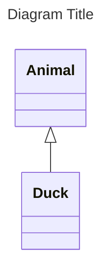

Key Components
- Classes: Represent entities in a system.
- Attributes: Characteristics of classes.
- Methods: Operations that the classes can perform.
- Relationships: Connections between classes (e.g., inheritance, aggregation).

#### Example
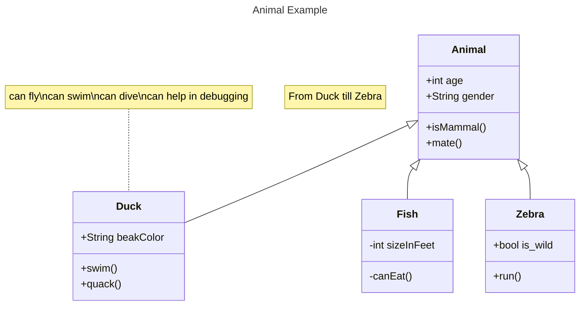

#### Defining Classes
Two Ways to Define a Class
1. Explicitly Using the Keyword class:
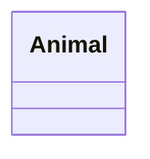
2. Via a Relationship:
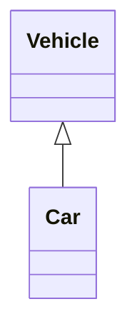

#### Naming Convention
A class name should consist only of alphanumeric characters (including unicode), underscores (_), and dashes (-).

### Class Members
Defining Members of a Class UML represents class members such as attributes and methods through the following methods:

Individual Member Definition using the Colon (:):
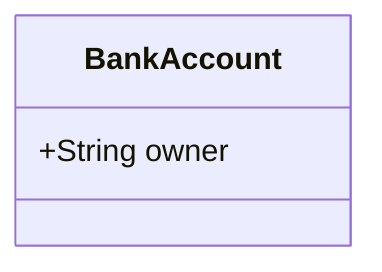

Grouped Member Definition Using Braces ({}):
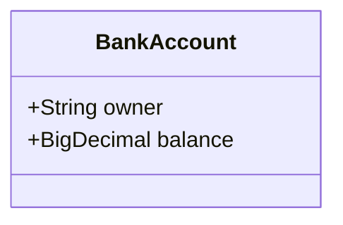

### Member Visibility
To describe the visibility of an attribute or method:
- \+ Public
- \- Private
- \# Protected
- ~ Package/Internal

### Return Type
You can specify an optional return type for methods:
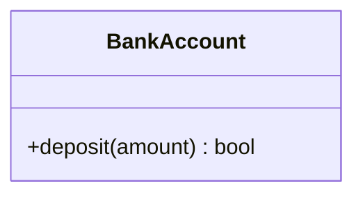

### Generics
Generics can be represented using the tilde (~):
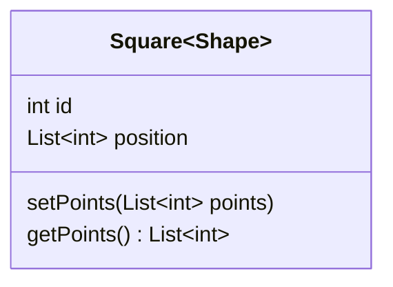

### Relationships
The following relationship types are supported:
- Inheritance: <|--
- Composition: *--
- Aggregation: o--
- Association: -->
- Dependency: ..>
- Realization: ..|>

And Link can be one of:
- Solid: --
- Dashed: ..

#### Example Relationships
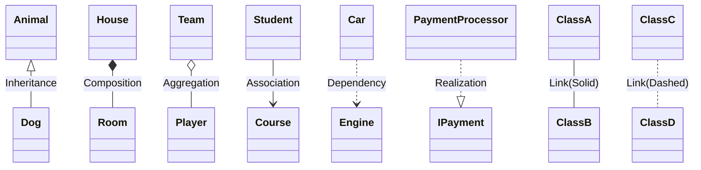

1. Inheritance (<|--)  
**Meaning**: Represents a hierarchical relationship between a superclass (parent) and a subclass (child). The subclass inherits attributes and methods from the superclass.  
**When to Use**: Use inheritance when creating a specialized version of a class that retains the properties and behaviors of a more general class. It's suitable for modeling "is-a" relationships (e.g., a Dog is an Animal).

2. Composition (*--)  
**Meaning**: Denotes a strong ownership relationship where a part (child) cannot exist independently of the whole (parent). If the parent is destroyed, so are its children.  
**When to Use**: Use composition when a class is made up of one or more parts that are tightly coupled to the parent class. It illustrates strong containment (e.g., a House contains Rooms).

3. Aggregation (o--)  
**Meaning**: Represents a weak ownership relationship where a part can exist independently of the whole. The part can belong to multiple wholes.  
**When to Use**: Use aggregation when modeling relationships where a class contains references to other classes, but those classes can exist independently. It signifies a "has-a" relationship (e.g., a Team has Players, but players can exist outside the team).

4. Association (-->)  
**Meaning**: Indicates a general relationship between two classes, where one object connects to another, typically involving navigation from one to the other.  
**When to Use**: Use association for general relationships between classes without ownership. It can represent various relationships where both objects can exist independently (e.g., a Student and a Course might be associated, with students enrolling in courses).

5. Dependency (..>)  
**Meaning**: Signifies a relationship where one class (the client) depends on another class (the supplier) for its functionality. Changes in the supplier may affect the client.  
**When to Use**: Use dependency when a class relies on another class for its operations, especially in scenarios where the dependency is temporary or subject to change (e.g., a Car class might depend on an Engine class).

6. Realization (..|>)  
**Meaning**: Represents a relationship between an interface and a class that implements the interface. The implementing class agrees to fulfill the behavior defined by the interface.  
**When to Use**: Use realization when a class provides the implementation for an interface’s specified methods. This is relevant in scenarios involving polymorphism or when defining service contracts (e.g., a PaymentProcessor class realizes the IPayment interface).

### Multiplicity
Multiplicity indicates the number of instances of one class that can be associated with another:
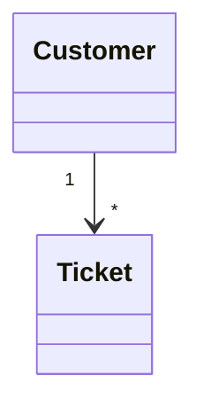

### Annotations
Annotations provide additional metadata about a class. Add annotations using double angle brackets <<>>:
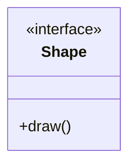

### Comments
Comments in a class diagram can be added by preceding the line with %%:
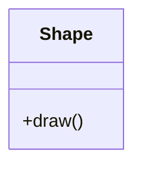

### Action Binding
You can bind click events to nodes:
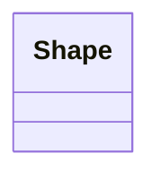

### Styling Nodes
You can apply styles to specific nodes:
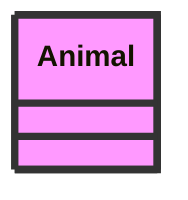